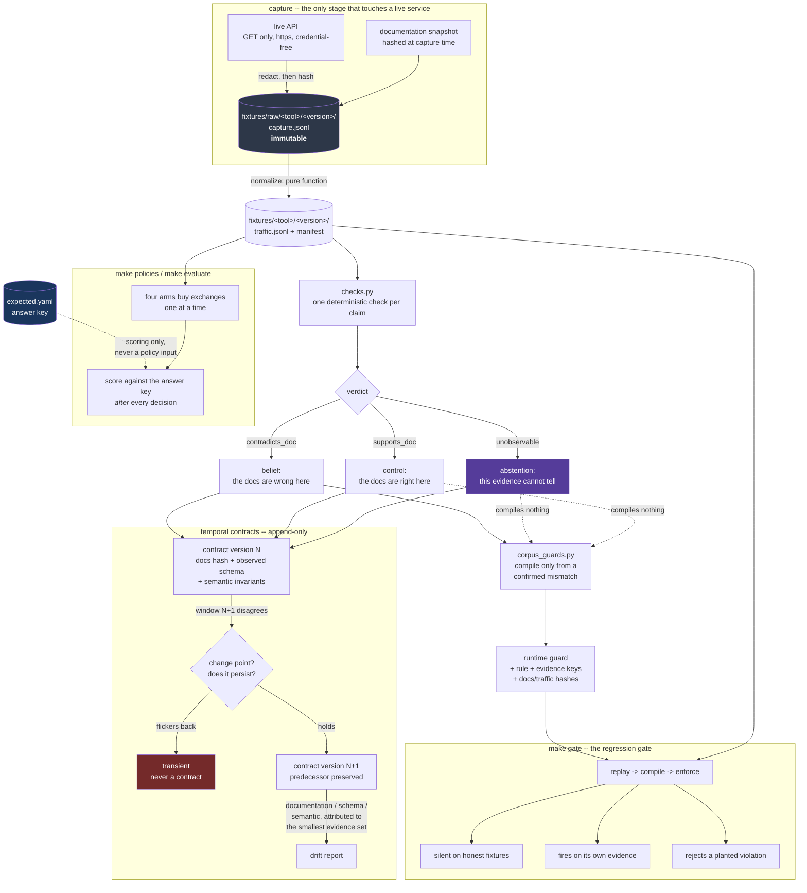

# Architecture, and what this system cannot do

## The flow

## Why the pieces are separated this way

**Raw is separate from normalized** because which headers matter is a judgement
made later, and a capture that discarded the answer cannot be re-asked without
going back to a service that has since changed. Normalization is a pure
function of raw, and `verify()` re-runs it to prove nobody hand-edited the copy
the tests read.

**The answer key is separate from the checks.** `expected.yaml` is prose
stating what the documentation promised and what the tool does;
`fixtures/checks.py` is the executable half. Keeping them apart means a check
can be corrected without rewriting and re-hashing a fixture, and it keeps the
answer key out of reach of anything that makes decisions.

**Three verdicts, not two.** Every vacuous-measurement bug in this project's
history came from a check with only two answers available, which therefore had
to pick one. `unobservable` is what an empty sweep, a uniform failure, and a
probe of a date that could not have been substituted all return.

**Contracts are append-only.** The old contract is the only record that a
change happened; overwriting it destroys the evidence for the thing being
reported.

**Guards compile only from confirmed mismatches.** An abstention that compiled
to enforcement would be a "we could not tell" silently promoted to a "we know".

---

## What this system cannot observe or safely infer

Stated because the boundary is part of the result.

### It cannot see anything outside a recorded response

Two claims in the corpus are marked `unobservable` and produce no belief and no
guard:

- **GitHub's `x-ratelimit-reset`** names a moment an hour after capture. A
  recording contains no observation of a later moment, so the promise can be
  neither confirmed nor refuted.
- **REST Countries' `?fields=` semantics** are unobservable for a different
  reason: a valid field list, a partly invalid one and a wholly invalid one
  return byte-identical bodies, because the deprecation short-circuits before
  any field handling. Nothing distinguishes the inputs.

### A recording is a sample, not the API

The observed schema is a union over the successful calls in a window, which
makes it a **lower bound** on the real shape. A field absent from three calls
may simply not have been in those three. The drift detector accounts for this -
a narrower schema from a smaller sample is reported as a sampling event, not a
removed field - but the underlying limit stands: this system knows what it
recorded, not what the API can do.

### It cannot tell you why a tool behaves as it does

Every verdict is about observed behaviour against written documentation. "The
date was substituted" is supported; "the date was substituted because the
cache falls back to the last publication" is not, and nothing here should be
read as establishing intent or mechanism.

### The corpus is small and its probes cost the same

54 exchanges across 8 tools. Every recorded exchange costs exactly one call, so
the cost term in the information-gain score is constant across candidates and
the policy comparison measures information only. A corpus with genuinely uneven
probe costs would test more of the selection policy than this one does.

### Licence boundaries are recorded as stated, not as verified

Each manifest carries the source's terms URL and a `verified_from_terms_page`
flag. That flag is `false` for most fixtures: the terms page was not
independently parsed during capture, and the boundary is recorded as the source
states it rather than as this project has confirmed it.

### The live-lab numbers are not re-established here

The historical A/B result - equal task success with 35% fewer tool calls, 37%
fewer tokens, 71% lower wall time - came from live runs against the lab with
real model calls. Nothing in the offline package reproduces it, and it remains
historical until re-run. The same is true of the precision/recall boundary
(0.83 precision, 0 false beliefs, 0.38 observable recall), which is a
`bench/score.py` measurement against the lab's own answer key.

### Mutation coverage is a floor, not a proof

25 mutations across 12 defect classes all die. That establishes those 25
behaviours are protected. It does not establish that no other behaviour can
regress silently, and a mutation whose anchor stops matching the source is
reported `NOT APPLIED` precisely so an unapplied mutation is never mistaken for
a passing one.
